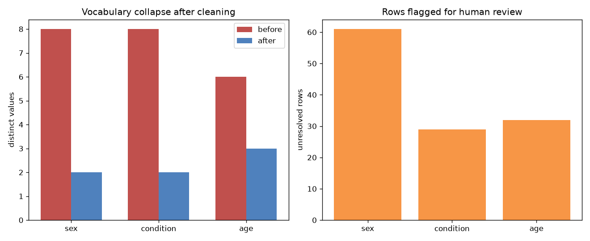

# public-metadata-janitor

Everyone wants to build the model. Nobody wants to fix the metadata. That is exactly why the metadata stays broken.

If you have ever pulled a dataset from GEO, SRA, or a supplementary Excel file and found `age` stored as "45y", "45 years", "forty-five", and `NA` in the same column, this repo is for you. The glamorous part of bioinformatics is a rounding error compared to the hours spent making columns agree with each other.

## Demo Output



The plot above was produced from simulated data by `demo.py`, showing how many messy values get normalised into clean categories.

## Why This Exists

Public data is a gift and a curse. The gift: thousands of samples for free. The curse: every submitter invented their own vocabulary. Before you can combine studies, you have to make the metadata speak one language. This toolkit gives you a repeatable, auditable cleaning pass instead of a pile of ad-hoc `str.replace` calls buried in a notebook.

## What It Does

- Normalises free-text categorical fields (sex, tissue, condition) to a controlled vocabulary.
- Parses messy numeric fields (age, dose) that mix units and words.
- Flags rows that fail validation instead of silently dropping them.
- Emits a cleaning report so a human can verify every automated decision.

## Quickstart

```bash
pip install -r requirements.txt
python demo.py            # self-contained, writes figures/ and results/
python clean_metadata.py --input messy.csv --output clean.csv
```

## The Uncomfortable Truth

Automated cleaning does not understand your biology. It maps strings. When it maps "tumour" and "tumor" to the same bucket, great. When it silently maps "control" and "untreated control" and "vehicle" to different buckets, your downstream analysis is quietly wrong. Always read the report.

## When NOT to Use This

| Situation | Use this? | Why |
|-----------|-----------|-----|
| Combining 3+ public cohorts | Yes | Vocabulary drift is guaranteed |
| One clean in-house dataset | No | You already control the schema |
| Fields needing domain judgement | Partly | Automate the easy 80%, verify the rest by hand |
| Regulatory submission data | No | You need documented manual QC, not heuristics |

## Failure Modes

- **Over-eager fuzzy matching** collapses distinct categories. Keep the threshold conservative.
- **Locale-dependent number parsing** (comma decimals) will bite you. Normalise encoding first.
- **Trusting the report you never read.** The tool flags problems; it does not fix your not reading them.

Hard truth: if you cannot explain every transformation your cleaning code made, you have not cleaned the data — you have hidden its problems.

## Further Reading

Inspired by Ming 'Tommy' Tang, "Data Cleaning 'Janitorial Work' is Key to Unlocking Life Sciences Breakthroughs" (https://divingintogeneticsandgenomics.com/talk/2026-datawire-interview/).
